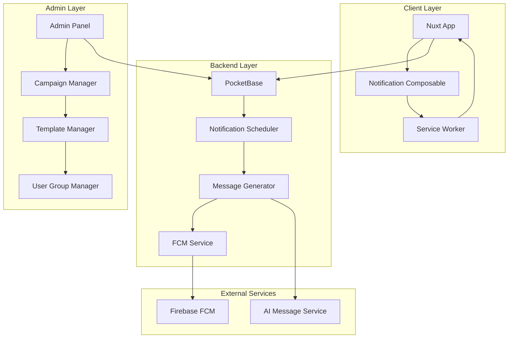
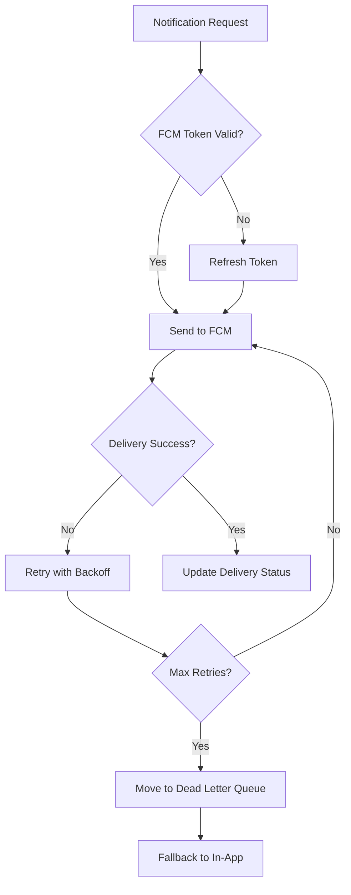

# Comprehensive Push Notification System Design

## Overview

The Zehna notification system is designed as a multi-layered, scalable solution that handles various notification types including post-session engagement, admin-initiated campaigns, and system alerts. The architecture leverages Firebase Cloud Messaging for reliable delivery, PocketBase for data persistence, and a sophisticated scheduling system for optimal user engagement.

## Architecture

### High-Level Architecture



### Component Architecture

The system follows a modular design with clear separation of concerns:

1. **Client Components**: Handle user interaction and foreground notifications
2. **Backend Services**: Manage scheduling, message generation, and delivery
3. **Admin Components**: Provide campaign management and user targeting
4. **External Integrations**: Firebase FCM and AI services

## Components and Interfaces

### 1. Enhanced Notification Composable (`useNotifications`)

**Purpose**: Central client-side notification management with extended functionality

**Key Methods**:
- `requestPermission()`: Request notification permissions
- `saveFCMToken()`: Store FCM token in PocketBase
- `listenToMessages()`: Handle foreground notifications
- `getNotifications()`: Fetch user notifications with pagination
- `markAsRead()`: Mark notifications as read
- `updatePreferences()`: Manage user notification preferences
- `subscribeToGroups()`: Subscribe to notification groups

**Enhanced Interface**:
```typescript
interface NotificationPreferences {
  enabled: boolean
  sessionReminders: boolean
  adminMessages: boolean
  systemAlerts: boolean
  quietHours: {
    start: string // "22:00"
    end: string   // "08:00"
  }
  frequency: 'immediate' | 'hourly' | 'daily'
}

interface NotificationGroup {
  id: string
  name: string
  description: string
  userCount: number
  criteria: GroupCriteria
}
```

### 2. Notification Scheduler Service

**Purpose**: Intelligent scheduling and delivery coordination

**Core Functions**:
- Session-triggered notification scheduling
- Campaign-based notification scheduling
- Retry logic for failed deliveries
- User engagement optimization

**Scheduling Algorithm**:
```typescript
interface SchedulingRule {
  trigger: 'session_complete' | 'admin_campaign' | 'system_event'
  delays: number[] // minutes
  priority: 'low' | 'medium' | 'high' | 'urgent'
  conditions: SchedulingCondition[]
}

interface SchedulingCondition {
  type: 'user_active' | 'time_window' | 'engagement_score'
  operator: 'gt' | 'lt' | 'eq' | 'between'
  value: any
}
```

### 3. Message Generator Service

**Purpose**: AI-powered personalized message creation

**Features**:
- Template-based message generation
- Dynamic content insertion
- Multi-language support
- Context-aware personalization

**Message Template Structure**:
```typescript
interface MessageTemplate {
  id: string
  name: string
  category: 'session' | 'admin' | 'system'
  language: 'fa' | 'en'
  template: {
    title: string
    body: string
    actionText?: string
    actionUrl?: string
  }
  variables: TemplateVariable[]
  conditions?: TemplateCondition[]
}

interface TemplateVariable {
  name: string
  type: 'string' | 'number' | 'date' | 'boolean'
  source: 'user' | 'session' | 'system'
  fallback?: any
}
```

### 4. Admin Panel Components

**Purpose**: Comprehensive campaign and user management

**Key Features**:
- Campaign creation and management
- User group segmentation
- Template management
- Analytics and reporting

**Campaign Management Interface**:
```typescript
interface NotificationCampaign {
  id: string
  name: string
  description: string
  status: 'draft' | 'scheduled' | 'active' | 'paused' | 'completed'
  targetGroups: string[]
  template: MessageTemplate
  schedule: CampaignSchedule
  metrics: CampaignMetrics
}

interface CampaignSchedule {
  type: 'immediate' | 'scheduled' | 'recurring'
  startDate?: Date
  endDate?: Date
  frequency?: 'daily' | 'weekly' | 'monthly'
  timezone: string
}
```

### 5. User Group Manager

**Purpose**: Dynamic user segmentation and targeting

**Segmentation Criteria**:
- User role (patient, therapist, admin)
- Activity level (active, inactive, new)
- Session history (frequency, recent activity)
- Engagement score
- Custom tags and attributes

**Group Management Interface**:
```typescript
interface GroupCriteria {
  rules: GroupRule[]
  operator: 'AND' | 'OR'
}

interface GroupRule {
  field: string // 'role', 'last_active', 'session_count', etc.
  operator: 'eq' | 'gt' | 'lt' | 'contains' | 'in'
  value: any
}
```

## Data Models

### Enhanced Database Schema

#### Notifications Collection
```typescript
interface Notification {
  id: string
  title: string
  message: string
  type: 'session' | 'admin' | 'system'
  priority: 'low' | 'medium' | 'high' | 'urgent'
  recipient_user_id: string
  campaign_id?: string
  template_id?: string
  is_read: boolean
  read_at?: Date
  action_url?: string
  action_text?: string
  scheduled_for: Date
  sent_at?: Date
  delivered_at?: Date
  clicked_at?: Date
  metadata: Record<string, any>
  created: Date
  updated: Date
}
```

#### Notification Campaigns Collection
```typescript
interface NotificationCampaign {
  id: string
  name: string
  description: string
  status: 'draft' | 'scheduled' | 'active' | 'paused' | 'completed'
  creator_id: string
  target_groups: string[]
  template_id: string
  schedule: CampaignSchedule
  sent_count: number
  delivered_count: number
  opened_count: number
  clicked_count: number
  created: Date
  updated: Date
}
```

#### Message Templates Collection
```typescript
interface MessageTemplate {
  id: string
  name: string
  description: string
  category: 'session' | 'admin' | 'system'
  language: 'fa' | 'en'
  title_template: string
  body_template: string
  action_text_template?: string
  action_url_template?: string
  variables: TemplateVariable[]
  is_active: boolean
  created: Date
  updated: Date
}
```

#### User Groups Collection
```typescript
interface UserGroup {
  id: string
  name: string
  description: string
  criteria: GroupCriteria
  user_count: number
  is_dynamic: boolean // auto-update based on criteria
  created_by: string
  created: Date
  updated: Date
}
```

#### Notification Preferences Collection
```typescript
interface NotificationPreferences {
  id: string
  user_id: string
  enabled: boolean
  session_reminders: boolean
  admin_messages: boolean
  system_alerts: boolean
  quiet_hours_start: string
  quiet_hours_end: string
  frequency: 'immediate' | 'hourly' | 'daily'
  timezone: string
  created: Date
  updated: Date
}
```

## Error Handling

### Comprehensive Error Management Strategy

#### 1. FCM Token Management
- Automatic token refresh on expiration
- Fallback to in-app notifications when FCM fails
- Token validation before sending notifications

#### 2. Delivery Failure Handling
- Exponential backoff retry mechanism
- Dead letter queue for persistent failures
- Alternative delivery channels (in-app, email)

#### 3. Service Worker Reliability
- Service worker update mechanism
- Fallback notification display
- Error logging and monitoring

#### 4. Database Resilience
- Connection pooling and retry logic
- Transaction rollback on failures
- Data consistency validation

**Error Handling Flow**:


## Testing Strategy

### Multi-Layer Testing Approach

#### 1. Unit Testing
- Notification composable methods
- Message template rendering
- User group criteria evaluation
- Scheduling algorithm logic

#### 2. Integration Testing
- FCM service integration
- PocketBase data operations
- Service worker message handling
- Admin panel functionality

#### 3. End-to-End Testing
- Complete notification flow testing
- Cross-browser compatibility
- Mobile device testing
- Background notification delivery

#### 4. Performance Testing
- Concurrent user load testing
- Batch notification sending
- Database query optimization
- Memory usage monitoring

### Test Scenarios

#### Critical Test Cases:
1. **Background Notification Delivery**: Verify notifications work when app is closed
2. **Campaign Targeting**: Ensure correct user group targeting
3. **Template Rendering**: Validate dynamic content insertion
4. **Retry Logic**: Test failure recovery mechanisms
5. **Permission Handling**: Test notification permission flows
6. **Multi-language Support**: Verify Persian/Farsi content display

#### Performance Benchmarks:
- Notification scheduling: < 5 seconds
- Campaign delivery: < 30 seconds for 1000 users
- Database queries: < 500ms for complex group queries
- Service worker response: < 100ms

## Security Considerations

### Data Protection and Privacy

#### 1. User Data Security
- Encrypted FCM token storage
- Secure notification content transmission
- User preference privacy protection

#### 2. Admin Access Control
- Role-based campaign creation permissions
- Audit logging for admin actions
- Secure template management

#### 3. Content Validation
- Input sanitization for templates
- XSS prevention in notification content
- Safe URL validation for action links

#### 4. Rate Limiting
- Per-user notification frequency limits
- Campaign sending rate controls
- API endpoint protection

### Compliance Requirements
- GDPR compliance for user data
- Healthcare data protection (if applicable)
- User consent management
- Data retention policies

## Performance Optimization

### Scalability Enhancements

#### 1. Database Optimization
- Indexed queries for user groups
- Efficient notification history storage
- Optimized campaign metrics calculation

#### 2. Caching Strategy
- Template caching for faster rendering
- User group membership caching
- FCM token caching

#### 3. Batch Processing
- Bulk notification sending
- Batch database operations
- Efficient user group evaluation

#### 4. Resource Management
- Connection pooling
- Memory usage optimization
- Background task queuing

### Monitoring and Analytics

#### Key Metrics:
- Notification delivery rates
- User engagement scores
- Campaign performance metrics
- System performance indicators

#### Alerting System:
- Failed delivery notifications
- System performance degradation
- High error rate alerts
- Capacity threshold warnings