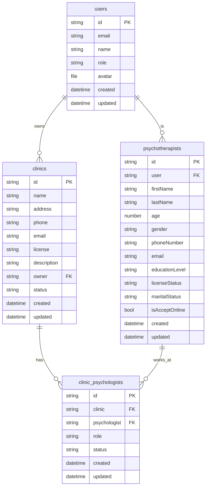

# PocketBase Collections for Clinic Management System

## Required Collections

### 1. `clinics` Collection

**Fields:**
- `id` (auto-generated)
- `name` (text, required) - Clinic name
- `address` (text, required) - Full address
- `phone` (text, required) - Phone number
- `email` (email, required) - Email address
- `license` (text, required) - License number
- `description` (text, optional) - Additional description
- `owner` (relation, required) - Links to `users` collection
- `status` (select, required) - Options: `active`, `inactive`, `pending`, `banned`, `verified`
- `verificationStatus` (select, required) - Options: `pending`, `approved`, `rejected`, `under_review`
- `verificationNotes` (text, optional) - Admin notes for verification
- `verifiedBy` (relation, optional) - Links to `users` collection (admin who verified)
- `verifiedAt` (date, optional) - Verification timestamp
- `bannedReason` (text, optional) - Reason for ban
- `bannedBy` (relation, optional) - Links to `users` collection (admin who banned)
- `bannedAt` (date, optional) - Ban timestamp
- `created` (date, auto-generated)
- `updated` (date, auto-generated)

**Indexes:**
- `owner` - For faster queries by owner
- `status` - For filtering by status
- `name` - For search functionality

**API Rules:**
- **List/Search:** Authenticated users can list clinics
- **View:** Authenticated users can view clinic details
- **Create:** Authenticated users can create clinics
- **Update:** Clinic owner or admin can update
- **Delete:** Clinic owner or admin can delete

### 2. `clinic_psychologists` Collection

**Fields:**
- `id` (auto-generated)
- `clinic` (relation, required) - Links to `clinics` collection
- `psychologist` (relation, required) - Links to `psychotherapists` collection
- `role` (select, required) - Options: `owner`, `member`
- `status` (select, required) - Options: `active`, `inactive`
- `created` (date, auto-generated)
- `updated` (date, auto-generated)

**Indexes:**
- `clinic` - For faster queries by clinic
- `psychologist` - For faster queries by psychologist
- `clinic, psychologist` - Composite index for unique constraints

**API Rules:**
- **List/Search:** Authenticated users can list relationships
- **View:** Authenticated users can view relationships
- **Create:** Clinic owner or admin can create
- **Update:** Clinic owner or admin can update
- **Delete:** Clinic owner or admin can delete

### 3. `psychotherapists` Collection (if not exists)

**Fields:**
- `id` (auto-generated)
- `user` (relation, required) - Links to `users` collection
- `firstName` (text, required)
- `lastName` (text, required)
- `age` (number, required)
- `gender` (select, required) - Options: `male`, `female`
- `phoneNumber` (text, required)
- `email` (email, required)
- `educationLevel` (select, required) - Options: `MAStudent`, `MA`, `PHDStudent`, `PHD`
- `licenseStatus` (select, required) - Options: `notHaveVolunteer`, `notHavePsychologyStudent`, `inProgress`, `haveOne`
- `maritalStatus` (select, required) - Options: `married`, `single`, `divorced`, `widowed`
- `isAcceptOnline` (bool, default: false)
- `created` (date, auto-generated)
- `updated` (date, auto-generated)

**Indexes:**
- `user` - For faster queries by user
- `email` - For search functionality

### 4. `users` Collection (if not exists)

**Fields:**
- `id` (auto-generated)
- `email` (email, required, unique)
- `name` (text, required)
- `role` (select, required) - Options: `user`, `admin`, `psychologist`
- `avatar` (file, optional)
- `created` (date, auto-generated)
- `updated` (date, auto-generated)

## Collection Relationships

## Setup Instructions

1. **Create Collections:**
   - Create the collections in PocketBase admin panel
   - Set up the fields as specified above
   - Configure the relationships properly

2. **Set API Rules:**
   - Configure authentication rules for each collection
   - Set appropriate permissions for create, read, update, delete operations

3. **Create Indexes:**
   - Add indexes for frequently queried fields
   - Add composite indexes for unique constraints

4. **Test the API:**
   - Use the PocketBase admin interface to test CRUD operations
   - Verify relationships are working correctly

## Migration Notes

If you already have existing data:
1. Create the new collections
2. Migrate existing data to match the new schema
3. Update any existing API calls to use the new field names
4. Test thoroughly before deploying to production

## Security Considerations

- Ensure proper authentication is set up
- Use role-based access control
- Validate all user inputs
- Implement rate limiting if needed
- Regular backup of data